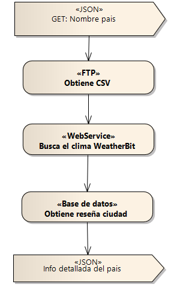

## Contexto

  

## Pasos previos

- [X] Ejecutar script  de base de datos import-postregsqlv11.sql
- [X] Descarga del driver JDBC disponible desde https://jdbc.postgresql.org/download.html
- [X] Archivos CSV alojados en un FTP
- [X] Crear una cuenta en Weatherbit y generar un API KEY

## Cadena de conexion

> JDBC URL: jdbc:postgresql://__HOST__:__PUERTO__/__NOMBRE_BD__

> Driver class name: org.postgresql.Driver
